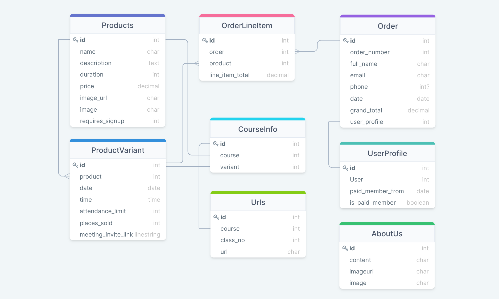
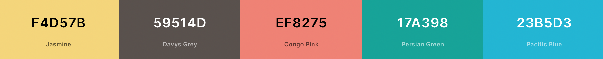

# APR Breathwork #

APR Breathwork is an ecommerce site designed to be used in the future by my partner, [**Aoife**](https://www.instagram.com/aoife.p.r/), who is currently in training to be a breathwork coach. After her studies she will be providing 1 to 1 and group breathwork classes both as 1 offs and 6 week courses. So she will be in need of a website where she can both advertise and sell these courses and classes

This platform will provide user's with a platform where they can:
- Read a bit about Aoife's background and qualifications
- Browse the various courses and classes she provides
- Pay for these classes and receive a link to attend live

The platform will also allow admins of the site to add edit and delete products (courses)

This project will use the Django framework for a MVC based application using Postgres databases to manage information.

[**Link to Live Site**]()

## Table of contents 

- [UX](#ux)
    - [Epics](#user-goals)
    - [User Stories](#user-stories)
- [Design Choices](#design-choices)
    - [Structure](#structure)
    - [Wireframes](#wireframes)
    - [Colors & Fonts](#colors)
- [Features](#features)
    - [Existing Features](#existing-features)
    - [Potential Future Feature](#future-features)
- [Testing](#testing)

- [Deployment](#deployment)
    - [Local Deployment](#local-deployment)
    - [Heroku Deployment](#heroku)
- [Technologies](#technologies)
- [Credits](#credits)

## UX ##

### Epics ###

Epics were used to identify the broad features and design considerations before breaking them down into the indivual user stories used to design the site.
1. As a user I can browse and search the different products available on the store and read about the business
2. As a user I can register for an account with the site
3. As a user I can purchase available products
4. As an admin I can manage products on the store

### User Stories ###

User Stories are grouped based on the epic they were distilled from.

- Epic One: Browsing Content
    - As a user I can view a product list showing all available courses
    - As a user I can view individual products for all the details
    - As a user I can view and select available times/dates for the class I want
    - As a user I can search for specific products I am looking for
    - As a user I can read additional information about the business

- Epic Two: User Accounts
    - As a user I can register for an account to save my details
    - As a user I can log in and out of my account
    - As a user I can view my order history when logged in

- Epic Three: Accepting payment
    - As a user I can view items in my cart
    - As a user I can move my cart items to checkout for payment
    - As a user I can securely provide payment details to pay for items in my cart

- Epic Four: Admin controls
    - As a site admin I can add new products to the store
    - As a site admin I can edit existing product details
    - As a site admin I can delete products from the store

## Design Choices ##

### Structure ###

Below you will find the structure and models that are used in the database for this project. Diagram was created using [**DrawSQL**](https://drawsql.app/)

|   | Products Model  |   |
|---|---|---|
| id  | IntegerField  | OnetoMany (ProductVariants)  |
| name  | CharField  |   |
| description | TextField  |  |
| duration  | DurationField  |   |
| price  | DecimalField  |   |
| image_url  | URLField  |   |
| image  | ImageField  |   |
| requires_signup  | BooleanField  |   |

|   | ProductVariant Model  |   |
|---|---|---|
| id  | IntegerField  |   |
| product  | ForeignKey  | ManytoOne (ProductID) |
| date | DateField  |  |
| time  | TimeField  |   |
| attendance_limit  | IntegerField  |   |
| places_sold  | IntegerField  |   |
| meeting_invite_link  | URLField  |   |

|   | Order Model  |   |
|---|---|---|
| id  | IntegerField  |   |
| order_number  | IntegerField  |   |
| full_name | CharField  |  |
| email  | EmailField  |   |
| phone  | CharField  |   |
| date  | DateField  |   |
| grand_total  | DecimalField  |   |
| user_profile  | ForeignKey  | ManytoOne (UserProfileID) |

|   | OrderLineItem Model  |   |
|---|---|---|
| id  | IntegerField  |   |
| order  | ForeignKey  | ManytoOne (OrderID) |
| product | ForeignKey  | ManytoMany (ProductID) |
| line_item_total  | Decimal  |   |

|   | UserProfile Model  |   |
|---|---|---|
| id  | IntegerField  |   |
| user  | ForeignKey  | OnetoOne (AuthUserID) |
| paid_member_from | DateField  |  |
| is_paid_member | BooleanField  | Default False  |

`is_paid_member` is set to True if the user purchases a multi session course to access replays of classes (Not available for once offs) Gets set back to False after set amount of time has elapsed since `paid_member_from`.

### Wireframes ###

Wireframes have been made for desktop, tablet and mobile versions of each page of the site. Links to each can be found below. Wireframes were created using [**Balsamiq**](https://balsamiq.com/wireframes/)

### Colors & Fonts ###

Main colors chosen for site (Yellow and Brown/Grey) were chosen to match current logo and aesthetic of her social media and personal site.

[**Coolors.co**](https://coolors.co/) was then used to generate a red/green/blue tone to match which could be used for warnings and alerts on the site. These will be used along with a clean white background.

## Features ##

### Existing Features ###

### Potential Future Features ###

## Testing ##

### Manual Testing ###

### Automated Testing ###

### Bugs ###

## Deployment ##

### Local Deployment ###

### Heroku Deployment ###

Struggles

## Technologies ##

### Languages ###

- [HTML](https://developer.mozilla.org/en-US/docs/Web/HTML)
- [CSS](https://developer.mozilla.org/en-US/docs/Web/CSS)
- [Python](https://www.python.org/)

### Libraries and Frameworks ###

- [Bootstrap](https://getbootstrap.com/)
- [Font Awesome](https://fontawesome.com/)

### Other ###

## Credits ##

